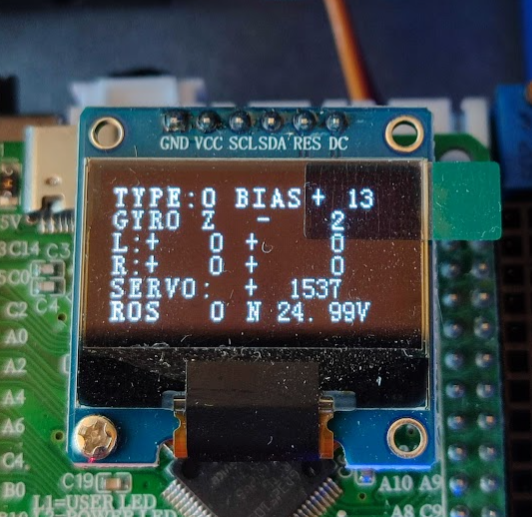
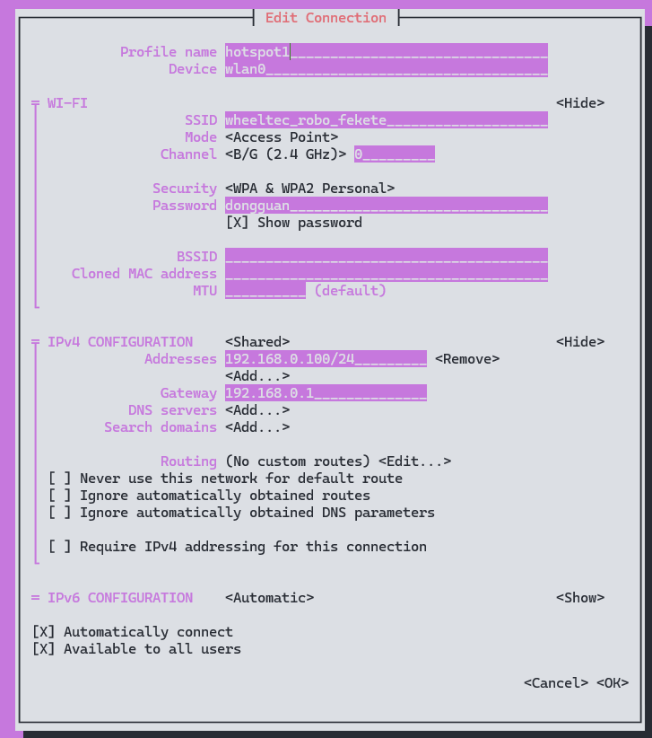

# fyi
Tudnivalók / For your information 

## Alapbeállítások / Default settings

|property <br /> tulajdonság | default <br/> alapértelmezett |
|---|---|
|`user@hostname` | `wheeltec@roboworks` <br />`wheeltec@192.168.0.1##` |
|SSID | `wheeltec_robo_##` |
|Password <br /> Jelszó | `dongguan` |

## Akkumulátor / Battery

|status | volt |
|---|---|
|🟢 | 21.0 `V`- 25.0`V` |
|🟡 | 20.0`V`- 21.0`V` |
|🔴 | < 20.0 `V` |



## Robot név és szín / Robot name and color

|`##` | color <br/> szín | english <br/> angol | hungarian <br/> magyar | robot name <br/> robot név | IP  <br/> `192.168.0.1##` |
|---|---|---|---|---|---|
|`01.` | | black | fekete | `robo_f` | `192.168.0.101` |
|`02.` | | grey | szürke | `robo_g` | `192.168.0.102` |
|`03.` | | white | fehér | `robo_w` | `192.168.0.103` |
|`04.` | | dark red | bordó | `robo_d` | `192.168.0.104` |
|`05.` | | red | piros | `robo_p` | `192.168.0.105` |
|`06.` | | orange | narancs | `robo_n` | `192.168.0.106` |
|`07.` | | yellow | sárga | `robo_s` | `192.168.0.107` |
|`08.` | | brown | barna | `robo_b` | `192.168.0.108` |
|`09.` | | blue | kék | `robo_k` | `192.168.0.109` |
|`10.` | | purple | lila | `robo_l` | `192.168.0.110` |
|`11.` | | green | zöld | `robo_z` | `192.168.0.111` |
|`12.` | | pink | rózsaszín | `robo_r` | `192.168.0.112` |
|`13.` | | beige | bézs | `robo_x` | `192.168.0.113` |


## `nmtui` / WiFi hotspot 

Network Manager Text User Interface

```yaml
Profile name: hotspot1
Device: wlan0
SSID: wheeltec_robo_#
Mode: Access Point
Security: WPA & WPA2 Personal
Password: dongguan
IPv4 address: from 192.168.0.101/24 to 192.168.0.113/24 
IPv4 gateway: 192.168.0.1
```




## VS code SSH

If your robot IP is `192.168.0.101` then:

```powershell
PS C:\Users\he> ssh wheeltec@192.168.0.101 mkdir -p .ssh
wheeltec@192.168.0.101's password:

PS C:\Users\he> cat .ssh/id_rsa.pub | ssh wheeltec@192.168.0.101 'cat >> .ssh/authorized_keys'
wheeltec@192.168.0.101's password:

PS C:\Users\he> ssh wheeltec@192.168.0.101
```


> [!TIP]
> Use the sample config file: [github.com/robotverseny/fyi/blob/main/useful/ssh_config](https://github.com/robotverseny/fyi/blob/main/useful/ssh_config)

# Install 

```powershell
wget https://raw.githubusercontent.com/robotverseny/fyi/main/useful/install_jazzy.sh
```

```powershell
sudo chmod +x install_jazzy.sh
```

Normal install:
```powershell
./install_jazzy.sh
```

Wifi option with `openssh-server`, so caution is advised:
```powershell
./install_jazzy.sh wifi
```

## Links
- [github.com/robotverseny/drivers](https://github.com/robotverseny/drivers/)
- [ssh login without password](https://github.com/szenergy/szenergy-public-resources/wiki/H-SSH-no-password)
- [material.io/resources/color](https://material.io/resources/color/#!/?view.left=0&view.right=0&primary.color=F44336)
- [materialui.co/colors](https://materialui.co/colors)
- [github.com/jkk-research/colors](https://github.com/jkk-research/colors/)
- [go.sze.hu/wh](http://go.sze.hu/wh)

## License


